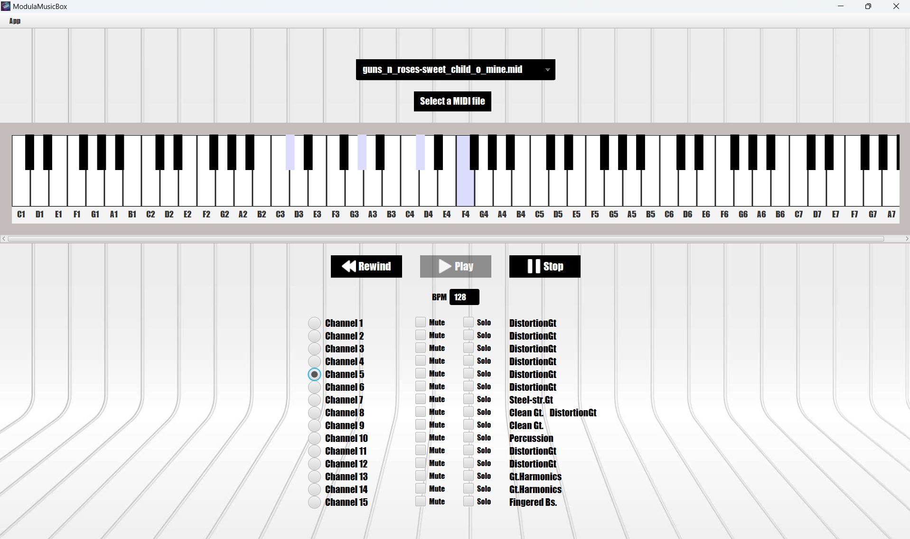

# ModulaMusicBox

**ModulaMusicBox** is a Java-based MIDI visualization and playback tool that brings a digital keyboard experience right 
to your screen. Load MIDI files, watch the keyboard light up with each note played, and interact directly with the 
keyboard to play your own notes!

## Features

- **MIDI File Loading**: Load MIDI files directly within the app.
- **Real-Time Key Visualization**: Observe which keys are currently being played on a MIDI track.
- **Instrument Channel Selection**: Choose individual instrument channels to focus on the notes of a specific instrument.
- **Interactive Keyboard**: Click on the digital keyboard to play notes manually and interact with the music.

