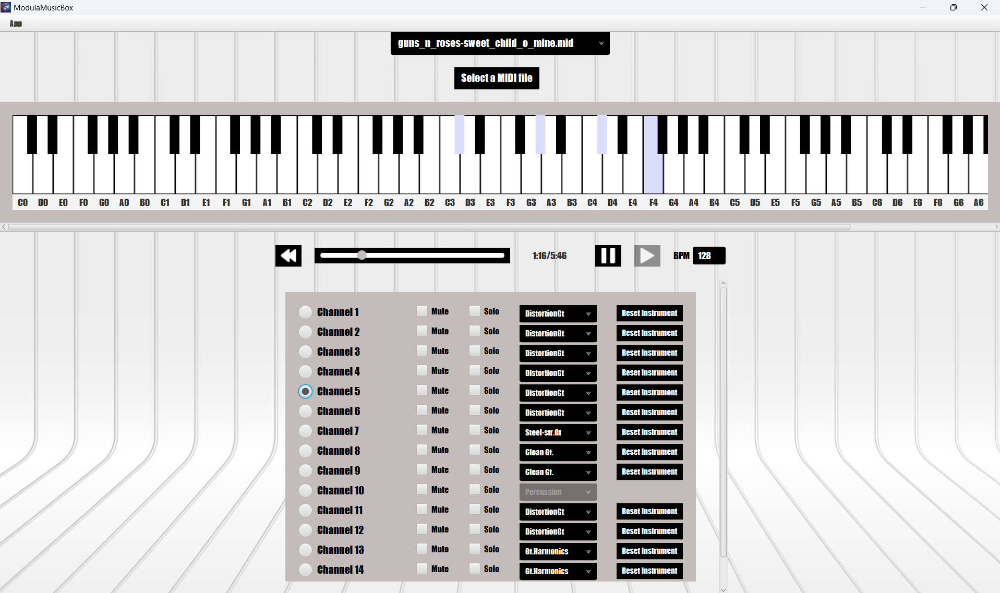

# ModulaMusicBox

**ModulaMusicBox** is a Java-based MIDI visualization and playback tool that brings a digital keyboard experience right 
to your screen. Load a MIDI file or select one from the predefined options, start the track, watch the keyboard illuminate 
in real time with each note played, and interact with the interface to play your own notes directly on the keyboard.

## Features

- **MIDI File Loading**: Load MIDI files directly within the app or select one from the available options in the dropdown menu.
- **Real-Time Key Visualization**: Observe which keys are currently being played on a MIDI track.
- **Instrument Channel Selection**: Choose individual instrument channels to focus on the notes of a specific instrument.
- **Interactive Keyboard**: Click on the digital keyboard to play notes manually and interact with the music.
- **Track Controls Configuration**: Use the dropdown menu to change the instrument for a specific channel 
or adjust the beats per minute to alter the track's playback speed. Solo and mute channels to focus on specific instruments.


   
## Installation
To install and run the application, follow one of these steps:
1. **Download the Executable** (Windows Only)
   - [modula-music-box.exe (ZIP)](https://github.com/zephyrquest/modula-music-box/releases/download/v1.0.0/ModulaMusicBox_v1.0.0.zip).
   - unzip the downloaded folder and run the executable to launch the application.
2. **Download the Source Code** (Java 17+ required)
   - [ZIP](https://github.com/zephyrquest/modula-music-box/archive/refs/tags/v1.0.0.zip)
   - [TAR](https://github.com/zephyrquest/modula-music-box/archive/refs/tags/v1.0.0.tar.gz)
   - unzip the downloaded folder and run the jar file
      ```bash
     java -jar ModulaMusicBox.jar
      ```

## Reporting Issues
If you encounter any problems or discover bugs, feel free to open a new issue. Your feedback is greatly appreciated!